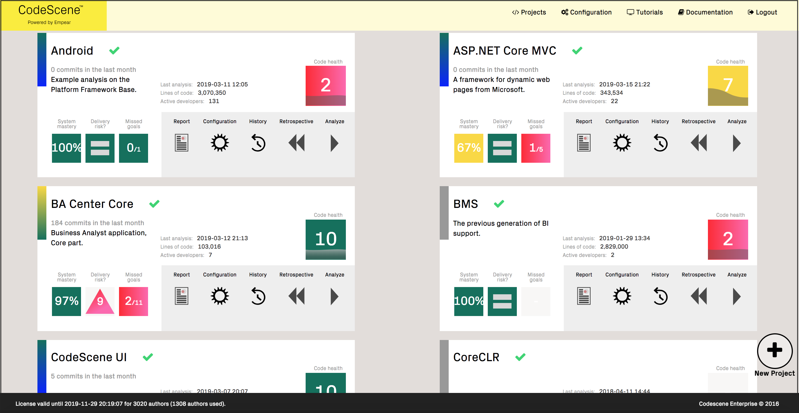

# CodeScene Linux Service

This repository contains a systemd configuration for running a CodeScene instance on Linux as a service.
With CodeScene as a Linux service, systemd will take care of:

* Automatic restart after server reboot.
* Automatic restart if the CodeScene service is killed.

## Installation

- Copy the `codescene.service` file to the `/etc/systemd/system`.
- Choose or create a user that the service will run as.
- Copy the `codescene-enterprise-edition.standalone.jar` to a directory accessible by the user. 
- Make sure the JAR file is accessible to the user.
- Complete the configuration below.
- Run `systemctl daemon-reload` to make systemd aware of the new service.
- Run `systemctl start codescene` to test.
- Navigate to `localhost:3003` to verify that CodeScene is
  running. You may have to wait a few seconds.
- If you want CodeScene to automatically start when the system starts, run `systemctl enable codescene`.

## Mandatory Configuration

### User

To use this script, make sure you create a `codescene` user. If you wish
to use a different system user, specify that user in the `User`
field. In this case, you will need to adjust several paths in the
configuration items below.

Note that the system user needs to have SSH credentials in their home directory.

### ExecStart path

We recommend placing the CodeScene JAR file in `/home/codescene`, if
you have defined a `codescene` user. For any other location, the
`ExecStart` line in `codescene.service` should point to that location.

### ExecStart Memory settings

If you analyse large applications with deep history, then you might
also want to increase the default `-Xmx8g` JVM memory option to
specify a larger maximum heap size.

### Java executable

Depending on your distribution, you may need to adjust the path to the
Java command.

### Database location

The configuration file also sets an environment variable for CodeScene's database:

    Environment=CODESCENE_DB_PATH=/home/codescene/codescene-db

Make sure that the `/home/codescene` part of this path exists and is
writable by the user.

## Optional Configuration

By default, `StartLimitIntervalSec` is set to `0`. This means that
systemd will attempt to restart the CodeScene service forever. If
you remove this option, systemd will give up after 5 failed
attempts.

## Debugging

Logs are available with the `journalctl -u codescene` command. You can
also run `systemctl status codescene`.

## About CodeScene

.

CodeScene was created as a reaction and complement to traditional static code analysis tools.
The main difference between CodeScene’s behavioral code analysis and traditional code scanning techniques is that
static tools work on a snapshot of the codebase while CodeScene considers the temporal dimension and evolution of the whole system.

This makes it possible for CodeScene to prioritize technical debt and code quality issues based on how the organization actually
works with the code. Hence, CodeScene limits the results to information that is relevant, actionable, and translates directly into business value.

Read more about CodeScene [here](https://empear.com/).
